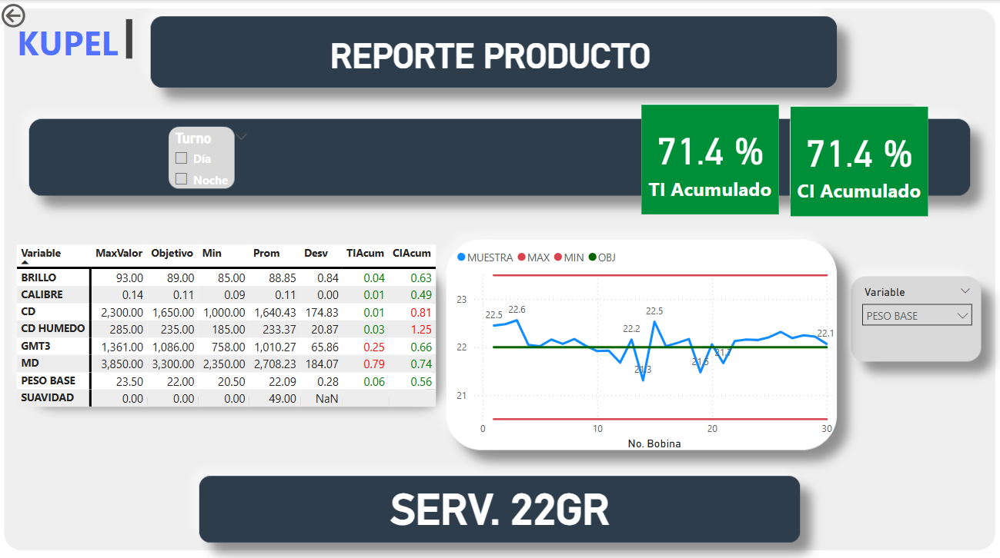

## Dashboards de Control de Calidad

## Desarrollé dashboards operativos y estratégicos para el aseguramiento de calidad en tiempo real y además, poder brindar una visión de alto nivel, permitiendo la identificación de patrones y optimización de procesos.

## Que es el TI y el CI
El TI (Target Index) y el CI (Consistency Index) son métricas estadísticas utilizadas en Kupel, heredadas de su pasado como parte de Kimberly-Clark.

TI (Target Index): Representa qué tan alineado está el desempeño del proceso con el objetivo establecido. Un TI alto indica que la producción se mantiene cerca del valor ideal, reflejando un alto nivel de precisión en el cumplimiento de estándares.

CI (Consistency Index): Mide la variabilidad del sistema, es decir, qué tan dispersos están los datos respecto al promedio. Un CI bajo indica estabilidad y uniformidad en la producción, mientras que un CI alto sugiere fluctuaciones significativas que pueden afectar la calidad y eficiencia del proceso.

Ambas métricas son esenciales para evaluar y optimizar la estabilidad operativa, asegurando un control riguroso de la calidad en la fabricación de productos.

## Dashboard operativo Reporte del Turno
La fabrica trabaja en 2 turnos diarios, donde el personal de calidad va rotando. Con un informe como este, el nuevo personal cuando ingresa puede entender como es la situacion actual del proceso, ingresando a su turno con la información necesaria para desarrollarse y prevenir de la mejor manera cualquier inconveniente. En este reporte se pueden ver las variables de calidad medidas, con su respectivo TI y CI, ademas de un TI y CI general del turno. Ademas tenemos graficas de visualizacion que nos muestran de mejor manera el desempeño a lo largo del turno.
## Linea Manufactura

## Linea Conversión - SINCRO

## Linea Conversión - Servilleta

## Dashboard Estrategico Acumulado
Se realizan reportes mensuales del desempeño del area de Calidad a gerencia. En este dashboard, se muestran los productos examinados en el mes o el tiempo de estudio, con sus respectivos TI y CI. Ademas de un TI y CI global dependiendo del peso de los mismos productos, es decir cantidad de productos producidos. Ademas de gráficas del TI y CI para ver su desempeño en el tiempo.
## Linea Manufactura

## Linea Conversión - SINCRO

## Linea Conversión - Servilleta

## Producto Acumulado
Este reporte proviene del reporte Acumulado, donde podemos hacer un Drillthrough para ver a mas detalle el desempeño de un producto especifico a lo largo de ese mes. Donde podemos analizar cada una de las variables medidas en calidad y ver como actuar a partir de estas.
## Linea Manufactura

## Linea Conversión - SINCRO

## Linea Conversión - Servilleta
